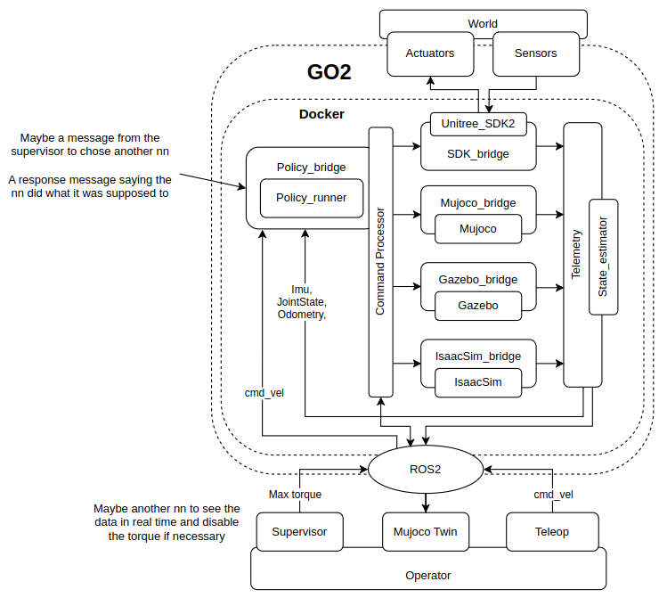

# Master's Thesis: High-Performance Quadruped Locomotion via Sim-to-Real Reinforcement Learning

> [!NOTE]
> This skeleton outlines the structure for your Master's thesis based on the Unitree Go2 Locomotion project. It is aligned with the architecture diagram in **Masters.pdf** and the current state of the repository. The document balances the **Software Architecture** (Docker-first deployment, the "Hybrid-ROS" decentralized control loop, and the Safety Supervisor) with the **Reinforcement Learning experiments** (curriculum learning, domain randomization, and recovery behaviors). Each section includes bullet points detailing the topics and concepts that should be discussed.

---

## 1. Introduction

*   **1.1 Context and Motivation**
    *   The rise of legged robotics and their versatility in unstructured environments.
    *   The transition from classical control (Model Predictive Control) to Deep Reinforcement Learning (DRL) for agile locomotion.
    *   The Sim-to-Real reality gap: challenges in transferring policies trained in simulation to physical hardware.
    *   The impact of communication latency (e.g., standard ROS 2 overhead) on high-frequency RL control loops.
*   **1.2 Problem Statement**
    *   Standard ROS 2 middleware introduces 5-10ms of jitter, which degrades the performance of policies trained with perfect synchronous simulation steps.
    *   Quadruped robots often suffer from local minima during training (e.g., shuffling, backward crawling, failing to stand up from a fall).
    *   Deploying RL policies across heterogeneous environments (sim vs. real, x86 vs. ARM64) requires a consistent, reproducible runtime.
*   **1.3 Objectives**
    *   To develop a **hardware-agnostic, decentralized, low-latency framework** that bypasses ROS 2 communication overhead for the critical control loop.
    *   To design a **robust curriculum learning strategy** in Isaac Lab that trains a policy capable of both walking and recovering from arbitrary falls (self-righting/stand-up).
    *   To validate the system using multiple simulators (MuJoCo, Gazebo, Isaac Sim) ensuring bit-perfect parity before real-world deployment on the Unitree Go2.
    *   To implement a **Docker-first deployment pipeline** that guarantees reproducible execution across the development workstation (VDI), laptop, and the physical robot's Jetson Orin.
*   **1.4 Contributions**
    *   A unified driver architecture with internal inference (the "Hybrid-ROS" approach), containerized via Docker for cross-platform parity.
    *   A multi-phase RL curriculum featuring anti-apathy incentives and stabilization rewards.
    *   A decoupled Safety Supervisor with fail-safe watchdog for real-time torque control.
    *   A successful sim-to-sim and sim-to-real transfer pipeline validated across MuJoCo, Gazebo, Isaac Sim, and the physical Go2.
*   **1.5 Thesis Outline**
    *   Brief description of the remaining chapters in the document.

---

## 2. Background and Related Work

*   **2.1 Quadruped Locomotion**
    *   Classical Control Methods: Model Predictive Control (MPC) and Whole-Body Control (WBC).
    *   Deep Reinforcement Learning (DRL) for Locomotion: End-to-end learning vs. hybrid approaches.
*   **2.2 Reinforcement Learning Formulations**
    *   Markov Decision Processes (MDP).
    *   Proximal Policy Optimization (PPO): The primary algorithm used for training stable policies.
    *   Reward shaping and curriculum learning concepts.
*   **2.3 Sim-to-Real Transfer Techniques**
    *   Domain Randomization: Varying mass, friction, motor strength, and sensor noise to create robust policies.
    *   Actuator Modeling: Accurate representation of motor dynamics, latency, and PD control loops.
*   **2.4 Simulation Environments**
    *   **Isaac Lab (NVIDIA):** Used for massively parallel GPU-based training.
    *   **Isaac Sim, MuJoCo, and Gazebo:** High-fidelity simulators used for validation and verification of the trained policies (Sim-to-Sim transfer).
*   **2.5 Middleware in Robotics**
    *   ROS 2 (Robot Operating System) and Data Distribution Service (DDS, specifically CycloneDDS).
    *   Trade-offs between modularity (ROS) and performance/latency (Internal loops).
*   **2.6 Containerized Deployment in Robotics**
    *   Docker as a standard for reproducible robotics environments.
    *   Challenges of multi-architecture deployment (AMD64 vs. ARM64/Jetson).

---

## 3. Unified Software Architecture for Sim-to-Real

> [!NOTE]
> This chapter should be heavily illustrated by the architecture diagram from `Masters.pdf`. The diagram shows the full system: the **World** (Actuators/Sensors) at the top, the **GO2/Docker** boundary containing the four bridge modules, the **Command Processor**, the **Policy Runner**, and the **Telemetry/State Estimator** feedback loop. Below the Docker boundary, **ROS 2** connects the monitoring layer: **Supervisor**, **MuJoCo Twin**, and **Teleop**, all under the **Operator** layer.

*   **3.1 System Overview**
    *   The three-layer architecture as shown in the diagram:
        *   **World Layer**: The physical environment with Actuators and Sensors.
        *   **GO2/Docker Layer**: The containerized execution boundary containing the control pipeline.
        *   **Operator Layer**: User-facing tools (Supervisor, Digital Twin, Teleop) connected via ROS 2.
    *   The "Hybrid-ROS" philosophy: Using ROS 2 strictly for telemetry, monitoring, and operator commands (`/cmd_vel`, `/safety/max_torque`), while keeping the high-frequency control loop (50Hz inference, 200-500Hz actuator loops) entirely internal.
    *   Decentralized Control: How each Driver (Sim or Real) locally instantiates the inference engine to achieve sub-millisecond latency.

*   **3.2 Centralized Configuration (`Configs/`)**
    *   The `config.yaml` as the single source of truth for all robot parameters: control gains (`kp`, `kd`), action scaling, saturation limits, joint limits, safety parameters, networking, and state estimator settings.
    *   The `config_loader.py` module providing a unified `load_config()` function used by all components (Controller, Telemetry, Supervisor, Launcher).
    *   Why centralizing configuration eliminates parameter drift between components and simplifies deployment.

*   **3.3 Hardware-Agnostic Core Components**
    *   **`Telemetry/` Package** (right side of diagram):
        *   **`TelemetryManager` (`telemetry.py`):** The centralized state standardizer. How it converts disparate sensor data (from MuJoCo, Isaac Sim, Gazebo, CycloneDDS/SDK2, or the real robot) into a universal `StandardState` object.
            *   Joint grouping: Type-Grouped order (FL_hip, FR_hip, RL_hip, RR_hip, FL_thigh, ...).
            *   Coordinate frames: Body-frame for IMU and velocity, world-frame optional for position.
            *   ROS 2 publishing of standardized state to `/sensors/joint_states`, `/sensors/imu`, `/odom` for the monitoring layer.
        *   **`StateEstimator` (`estimator.py`):** Contact-aided linear velocity estimation for real-robot deployment.
            *   Gravity compensation: `a_linear = f_imu + R^T * g_world`.
            *   Integration: `v += a_linear * dt`.
            *   Contact-based decay with configurable decay rates (from `config.yaml`): 4 feet (standing) → fast decay, 0 feet (airborne) → minimal decay.
            *   Configurable toggle: `use_estimator` flag (Constructor → ENV → YAML → Default).
    *   **`Controller/` Package** (left and center of diagram):
        *   **`PolicyRunner` (`policy_runner.py`):** The cross-platform PyTorch inference engine.
            *   Automatic checkpoint inspection: detects `obs_dim` and layer sizes from `.pt` files.
            *   Support for both SKRL state-dict checkpoints and JIT-traced models.
            *   `RunningStandardScaler` for observation normalization (loaded from checkpoint).
            *   Generic `build_obs()` supporting 49-dim (blind proprioception), 54-dim (with contacts + height), and arbitrary height-scan dimensions.
            *   Decimation control: Policy runs at 50Hz while actuator loops run at 200-500Hz.
        *   **`CommandProcessor` (`policy_bridge.py`):** The safety-first action pipeline (shown as "Command Processor" in diagram).
            *   Hardware-aware action scaling: `targets = actions * action_scale + desired_qpos`.
            *   Saturation: Clamped to 90% (configurable) of physical joint limits.
            *   **Safety Watchdog**: Subscribes to `/safety/max_torque` from the Supervisor. Starts with `active_max_torque = 0.0` (fail-safe: no torque until Supervisor heartbeat). If no heartbeat received within `watchdog_timeout` (default 1.0s), torque is zeroed.
            *   Publishes commanded joint positions and effort limits to `/commands/joint_commands`.

*   **3.4 Multi-Simulator Bridge Modules** (center-right of diagram)
    *   Developing specific bridge/driver pairs for each backend, as shown in the diagram:
        *   **`Unitree_SDK2` → `SDK_bridge`** (`Unitree/real_driver.py`): CycloneDDS interface to the physical Go2 hardware at 192.168.123.18.
        *   **`Mujoco` → `Mujoco_bridge`** (`Mujoco/mujoco_driver.py`): High-fidelity local simulation with headless mode support.
        *   **`Gazebo` → `Gazebo_bridge`** (`Gazebo/gazebo_driver.py`): ROS 2-native Gazebo Sim integration.
        *   **`IsaacSim` → `IsaacSim_bridge`** (`IsaacSim/isaac_driver.py`): NVIDIA Isaac Sim standalone bridge for GPU-accelerated validation.
    *   Ensuring bit-perfect parity: All drivers feed data through the same `TelemetryManager.process_state()` and receive commands through the same `CommandProcessor.process()`. If a policy works in the validation simulator, it is mathematically guaranteed to see the same inputs on the real hardware.

*   **3.5 Operator Monitoring Layer** (bottom of diagram)
    *   **`DigitalTwin/` Package:**
        *   **`SupervisorNode` (`supervisor.py`):** Decoupled ROS 2 safety node.
            *   Subscribes to `/sensors/joint_states`, `/sensors/imu`, `/odom`.
            *   Runs a configurable safety check loop (default 10Hz from `config.yaml`).
            *   Publishes `/safety/max_torque` — the CommandProcessor's watchdog depends on this heartbeat.
            *   Future home of a Safety Neural Network for real-time stability assessment (as annotated in the diagram: "Maybe another nn to see the data in real time and disable the torque if necessary").
        *   **`MujocoTwinNode` (`mujoco_twin.py`):** Passive real-time 3D visualization.
            *   Subscribes to the same telemetry topics as the Supervisor.
            *   Renders the robot's live state in a MuJoCo viewer with disabled gravity/collisions (pure kinematic replay).
            *   Integrates body-frame velocity into world-frame position for smooth tracking.
    *   **`Teleop`:** ROS 2 `teleop_twist_keyboard` publishing `/cmd_vel` for steering commands.
    *   The Operator can run all three tools simultaneously for comprehensive real-time monitoring.

*   **3.6 Docker-First Deployment Pipeline**
    *   The `Docker/Dockerfile` based on `ros:humble-ros-base` providing a consistent ROS 2 Humble environment.
    *   Environment detection in the `launcher.py`: `IS_DOCKER` (checking `/.dockerenv`), `IS_ROBOT` (checking ARM64 architecture).
    *   Feature gating: Training and IsaacLab features disabled inside Docker; ROS 2-dependent features (MuJoCo, Gazebo, Deploy, Twin, Supervisor) disabled without Python 3.10 or Docker.
    *   The same Docker image deployed on the VDI development workstation and the physical robot's Jetson Orin.

*   **3.7 Unified Launcher**
    *   The `launcher.py` as the single entry point for all operations: Train, Play (Isaac Lab/Sim), MuJoCo, Gazebo, Deploy, Teleop, Digital Twin, and Safety Supervisor.
    *   Automatic checkpoint discovery: scans `IsaacLab_Tasks/*/logs/` for `best_agent.pt`.
    *   Automatic observation dimension detection from checkpoint metadata (`agent.yaml`).
    *   "Repeat Last Command" with Docker-awareness and safety defaults (persisted to `.launcher_last_command.json`).
    *   Configurable `ROS_DOMAIN_ID` for network isolation (default from `config.yaml`).

---

## 4. Reinforcement Learning Environment and Curriculum

*   **4.1 Environment Design (Isaac Lab)**
    *   **Observation Space:** Using blind proprioception (49 dimensions), removing height scanners to force the robot to rely on IMU and joint states for robustness. Extended 54-dim variant includes foot contacts and base height.
    *   **Action Space:** Target joint positions added to the nominal stance via `action_scale` (0.25).
*   **4.2 Reward Function Shaping**
    *   **Task Rewards:** Tracking linear and angular velocity commands.
    *   **Locomotion Style Rewards:** Foot height lifting rewards, symmetric gait incentives, and `feet_air_time`.
    *   **Penalties:** Base contact penalties, flat orientation tracking (`flat_orientation_l2`), penalizing excessive joint velocities and torques.
*   **4.3 Curriculum Learning Phases**
    *   **Phase 1: Static Standing.** Incentivizing the robot to stand still without shuffling. Balancing rewards to prevent local minima.
    *   **Phase 4: Walking and Following Commands.** Transitioning from standing to robust locomotion.
    *   **Phase 5-6:** Adding sensor noise, friction variation, foot height rewards, robot morphology variation.
    *   **Phase 7:** Penalizing foot lifting while standing (gait phase awareness).
    *   **Phase 8:** GO2-specific training with tuned parameters.
    *   **Phase 9:** Spawning robot in random positions and orientations to improve robustness.
    *   **Phase 10: Recovery and Self-Righting.**
        *   Removing state-based termination (allowing the robot to fall upside down).
        *   Implementing Anti-Apathy/Anti-Farming Incentives: Torso-rotation rewards and penalty masking to force the robot to actively attempt a flip instead of farming rewards through useless leg jittering.
*   **4.4 Overcoming Training Challenges**
    *   Addressing the "crawling and backward-walking" local minima by tuning `base_contact_penalty`.
    *   Handling physics-induced instabilities (e.g., drop-shocks from spawning at 0.35m) by randomizing spawn positions and orientations.
    *   Adding actuator friction variation and sensor noise for sim-to-real robustness.

---

## 5. Experiments and Results

*   **5.1 Training Performance**
    *   Analyzing learning curves (PPO) in Isaac Lab.
    *   Reward convergence across the different curriculum phases.
    *   Impact of observation dimension choices (49 vs. 54 vs. height-scan).
*   **5.2 Latency and Performance Analysis**
    *   Comparing control loop times: Traditional ROS 2 architecture (5-10ms jitter) vs. the unified Internal Inference architecture (< 1ms jitter).
    *   Why Isaac Sim takes ~10ms for policy inference vs. MuJoCo's ~1ms (GPU scheduling overhead).
    *   The impact of the Docker container on inference latency.
*   **5.3 High-Fidelity Validation (Sim2Sim)**
    *   Demonstrating the transfer of the Isaac Lab policy to MuJoCo and Gazebo.
    *   Analyzing the robot's behavior under different friction and actuator noise conditions in these deterministic environments.
    *   Using the MuJoCo Digital Twin for real-time side-by-side comparison.
*   **5.4 Safety System Validation**
    *   Testing the watchdog fail-safe: verifying that torque drops to zero when the Supervisor heartbeat is lost.
    *   Measuring Supervisor response time at different frequencies (configurable via `config.yaml`).
    *   Testing the global max torque clamp as a hardware protection layer.
*   **5.5 Recovery and Robustness Testing**
    *   Evaluating the stand-up maneuver success rate from various fallen states (side, back).
    *   Testing the deadman switch and torque-override recovery mechanics.
*   **5.6 Real-World Deployment (Sim2Real)**
    *   Results of deploying the policy to the physical Unitree Go2 via Docker on the Jetson Orin.
    *   Comparing state estimator velocity vs. ground truth (sim) and analyzing its impact on real-world performance.
    *   Qualitative analysis of gait symmetry and stability on real terrain.

---

## 6. Discussion

*   **6.1 Architecture Efficacy**
    *   Why the decentralized, internal inference loop was critical for the success of the sim-to-real transfer.
    *   The role of centralized configuration (`config.yaml`) in eliminating parameter drift across components.
    *   How Docker containerization solved the "works on my machine" problem across VDI, laptop, and Jetson Orin.
*   **6.2 Safety Architecture**
    *   The importance of the fail-safe-first design (zero torque until Supervisor heartbeat).
    *   The Supervisor-CommandProcessor relationship as a model for safe RL deployment.
    *   Future potential: replacing the placeholder safety loop with a trained Safety Neural Network.
*   **6.3 The Importance of Curriculum Design**
    *   How balancing the transition from standing to walking, and finally to recovery, prevented the policy from collapsing.
    *   The effectiveness of anti-apathy incentives vs. standard reward shaping.
*   **6.4 Limitations**
    *   Current limitations of the blind proprioceptive approach (e.g., struggling with stairs or large obstacles).
    *   State estimator drift under sustained dynamic motion (IMU integration limitations).
    *   Gazebo integration instabilities (known issue in the project).

---

## 7. Conclusion and Future Work

*   **7.1 Summary of Contributions**
    *   A brief recap of the low-latency architecture, Docker-first deployment, safety system, and the successful training pipeline.
*   **7.2 Future Directions**
    *   **Exteroception:** Integrating vision and terrain point clouds (SLAM pipeline) to allow for dynamic obstacle avoidance and mapping.
    *   **Safety Neural Network:** Replacing the placeholder supervisor loop with a trained network that can predict instability and preemptively reduce torque.
    *   **Adaptive Friction:** Adding online friction estimation to adapt to slippery surfaces (e.g., ice, wet floors).
    *   **Dynamic Gaits:** Training policies for specific gaits (bounding, trotting, pacing) via user commands.
    *   **Advanced State Estimation:** Upgrading from contact-aided decay to an Extended Kalman Filter (EKF) with leg odometry integration (`v_body = -(R · J_i · dq_i + ω × r_i)`).
    *   **Terrain Inclination Estimation:** Using foot positions to estimate local ground slope for navigation on uneven terrain.

---

## References
*   [Include academic papers on PPO, Isaac Lab, Unitree robots, Sim-to-Real, Domain Randomization, Docker in Robotics, etc.]

## Appendices
*   **Appendix A:** Network Architectures and Hyperparameters (MLP: `[512, 256, 128]`, ELU activations, `RunningStandardScaler`).
*   **Appendix B:** Detailed Reward Function Weights per Curriculum Phase.
*   **Appendix C:** Complete `config.yaml` Configuration Reference.
*   **Appendix D:** Docker Environment Setup and Multi-Architecture Deployment Guide.
*   **Appendix E:** Architecture Diagram (Masters.pdf) with Component Mapping to Source Files.
