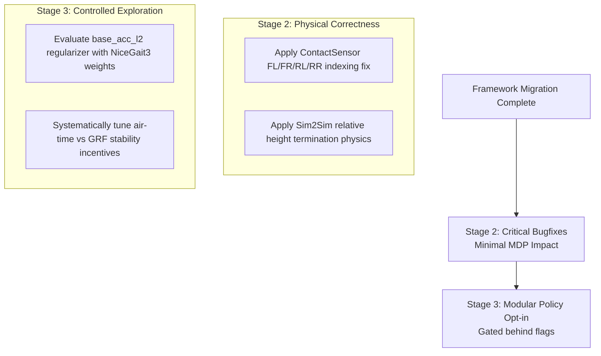

# In-Depth Engineering Analysis: Post-NiceGait3 Evolution & Framework Roadmap

**Baseline Commit:** `3dc5618` (*"NiceGait3" on branch `main`*)  
**Target Analysis Range:** All subsequent experimental commits and branches (`Slow`, `GaitClock1-7`, `NewReward`, `Memory`, and gravity-compensation features).

---

## Executive Summary

Since the verification of the **NiceGait3** (`3dc5618`) locomotion baseline, extensive development has occurred across two orthogonal axes:
1. **Framework & Deployment Infrastructure:** Substantial improvements to multi-phase training automation, dynamic inference adaptation, memory buffer management, simulation driver decimation, and CLI debugging telemetry.
2. **Policy, Environment & Reward Exploration:** Intensive algorithmic exploration aimed at resolving low-velocity locomotion (<0.3 m/s), mitigating Ground Reaction Force (GRF) spikes, eliminating base oscillations, and replacing heuristic gait shaping with a rhythmic, velocity-coupled Gait Phase Clock.

During these iterations, the coupling of architectural framework upgrades with experimental Markov Decision Process (MDP) modifications caused divergence from the smooth convergence and locomotion quality of NiceGait3. 

This document separates all developments into **Framework/Infrastructure Changes** (which should be preserved and migrated back to `main` cleanly) versus **Policy/Environment Changes** (which fundamentally alter RL training dynamics and require modular, gated re-introduction).

---

## Part 1: Framework & Infrastructure Enhancements
*Status: SAFE & HIGHLY RECOMMENDED TO PORT TO `main`*

These modifications improve developer ergonomics, automation, testing visibility, and cross-platform inference robustness without altering the theoretical formulation or gradients of the RL training policy.

### 1. Automated Multi-Phase Curriculum Sequencing (`launcher.py`)
In the NiceGait3 baseline, executing multi-phase curriculum transitions (e.g., Phase 1 $\to$ Phase 2 $\to$ Phase 3 $\to$ Phase 6) required manual intervention, manual directory renaming, and hardcoded checkpoint paths. The framework was overhauled with an automated sequential execution engine:
* **Recursive Configuration Merging (`deep_update` & `resolve_phase_launcher`)**: Implemented deep dictionary merging so that child phases in `training_phases.yaml` can inherit from a `default` or parent phase and override specific hyperparameter trees without dropping unspecified sibling keys or crashing via `KeyError`.
* **Automated Segment Execution (`compute_all_curriculum_segments`)**: Dynamically parses available curriculum phases and orchestrates sequential training loops automatically.
* **Intelligent Checkpoint Chaining (`find_highest_step_checkpoint` & `rename_latest_run_dir`)**: At the conclusion of a training phase, the runner automatically inspects modification/creation timestamps in the run output directory, identifies the latest `.pt` checkpoint (or highest training step), renames the run directory cleanly, and feeds the discovered checkpoint path directly as the initialization weights for the subsequent phase.

### 2. Dual-Policy Dynamic Inference Engine (`Controller/policy_runner.py` & `Controller/policy_manager.py`)
To provide extreme flexibility for future Neural Network sizes and arbitrary history lengths:
* **Dynamic Dimensionality Detection**: Replaced hardcoded input shapes by dynamically detecting the total observation dimension (`obs_dim`) from the loaded checkpoint's weights. The runner configures `_obs_dim_single` via environment variables (default 49) and calculates the observation history length automatically (`_obs_history_len = obs_dim // _obs_dim_single`).
* **Observation History Ring-Buffer**: Built an in-memory observation matrix (`_obs_history` of shape `(history_len, obs_dim_single)`). At each control tick, historical frames are shifted out using `np.roll(..., shift=1, axis=0)`, inserting the freshest observation at index `0`.
* **Episode Reset & Zero-Transient Initialization**: Added `reset_history()` and an `_episode_start` boolean flag. On the first inference execution after an episode reset or driver startup, the initial single-step observation is replicated across all historical time slots in the ring-buffer. This avoids injecting stale zero-padded observation sequences that trigger violent control transients in Sim2Sim or Sim2Real deployments.
* **Explicit Timing & Frequency Propagation**: Standardized simulation control timing by passing `dt=0.02` (50Hz decimation rate) across `PolicyManager.step_single`, `step_all`, and `PolicyRunner.infer`.

### 3. Simulation Driver Decimation & Telemetry (`Gazebo/`, `IsaacSim/`, `Mujoco/`, `Unitree/`)
* **Standardized Physics Decimation**: Explicitly coupled driver physics steps (`sim_dt`, e.g., 0.005s in Isaac Sim, 0.001s in Gazebo) with control decimation multipliers (e.g., `decimation = 4` for 200Hz physics $\to$ 50Hz neural network command rate).
* **Enhanced Real-Time Bridge Console**: Expanded CLI logging across all simulated and physical robot bridges. Terminal output during deployment now streams real-time base translational and rotational velocities ($v_x, v_y, \omega_z$), neural network forward-pass inference latency in milliseconds (`inf=Xms`), and running estimated gait frequency (`f=X.XXHz`).

### 4. Mathematical Documentation & Benchmark Standards (`rewards.md` & `reward_equations.md`)
* Formally codified the mathematical formulations, penalty weightings, physical rationales, and theoretical literature derivations for every active reward and constraint term across all phases of the quadruped locomotion curriculum.

---

## Part 2: Policy, Environment & Reward Modifications
*Status: MDP ALGERING & DIVERGENCE SOURCE (Requires Selective / Behind-Flag Porting)*

These modifications directly altered the Isaac Lab training environment (`quadruped_env.py`), state geometry (`quadruped_env_cfg.py`), curriculum mechanics (`training_phases.yaml`), or reset dynamics. While developed to solve complex behavioral edge-cases, several of these changes collectively introduced reward stagnation during Phase 1 training and disrupted the early convergence characteristic of NiceGait3.

### 1. Observation Geometry & Environment Initialization
* **Configurable Recurrent Memory Buffer**: Shifted observation stacking management into YAML configuration (`obs_history_len` in `training_phases.yaml`). The full state output became a flattened tensor of size `num_envs x (obs_history_len * obs_dim_single)`.
* **Reset Buffer Cleanup vs. Historical Gradient Carryover**: Re-engineered `_reset_idx` to explicitly clear and re-replicate initial state tracking buffers across the entire history tensor upon environment termination. 
  * *Critical Divergence Note:* In the NiceGait3 baseline, historical buffers (such as `feet_air_time`, old observation history steps, and `previous_actions`) were not strictly cleared across environmental resets. This benign "buggy carryover" inadvertently provided an initial noise spectrum and high-magnitude reward gradient spike in early Phase 1 training that accelerated policy locomotion discovery. Clean zeroing of these buffers eliminated this early gradient incentive, contributing to early-stage reward stagnation.

### 2. Gait Clock Dynamics & Foot Symmetry
* **ContactSensor Foot Indexing Fix**: Uncovered and corrected an indexing asymmetry in `quadruped_env.py`. Isaac Lab’s regex body matching (`.*_foot`) returned sensor IDs in an order inconsistent with the physics engine's standard joint actuator convention (`[FL, FR, RL, RR]`). Remapped feet IDs explicitly (`[c_feet_ids[2], c_feet_ids[3], c_feet_ids[0], c_feet_ids[1]]`), resolving diagonal gait skewing.
* **Gait Frequency Formula Evolution**: The coupling between commanded velocity and cyclical gait frequency ($f$) evolved through several mathematical forms across `ClockGait1-7`:
  * *Inverted/Linear iterations*: Initial approximations ($f = c \cdot v^2$ vs $f = \sqrt{v / c}$).
  * *Quadratic formulation*: $f = 0.2 \cdot v_{\text{eff}}^2$.
  * *Current Asymptote-Exponential formulation*:
    $$f(v_{\text{eff}}) = 0.6 \left(1 - e^{-5 v_{\text{eff}}}\right) + 0.4 v_{\text{eff}}$$
    where effective speed incorporates rotational turning velocity: $v_{\text{eff}} = \sqrt{v_x^2 + v_y^2} + 0.25 |\omega_z|$.
* **Velocity-Dependent Gait Blending**: Added logic in `quadruped_env.py` to calculate a sigmoid blending weight based on velocity, smoothly interpolating foot swing phase offsets from walking configurations at low speeds to trotting configurations (`[0.0, 0.5, 0.5, 0.0]`) at higher speeds.

### 3. Low-Speed Locomotion & Virtual Leash Constraints
To address standing-still local minima at low velocity commands (<0.3 m/s), several complex environmental rewards were experimented with in `Slow` and `NewReward`:
* **Virtual Target Tracking (`ref_pos_xy`, `ref_yaw`)**: Built an internal odometry integrator that advances a virtual target reference position and heading based on command velocities at each step.
* **Stall Penalty (`stall_val`) & Positional Leash Deviation (`pos_deviation_val`)**: Implemented dynamic penalty gates that actively punish the policy when linear speed falls below a stall threshold ($0.05\text{ m/s}$) while commanded to move, or when physical position deviates beyond a maximum virtual leash limit ($0.4\text{ m}$).

### 4. Ground Reaction Force (GRF) & Stability Regularization
* **Base Acceleration Regularizer (`rew_scale_base_acc_l2`)**: Introduced finite-difference calculation of body frame linear acceleration ($\Delta v / \Delta t$) to heavily penalize pitching, rolling, and jittery high-frequency trunk shaking.
* **Contact Force Normalization Modifications**: Transitioned from NiceGait3’s static force ceiling ($100\text{ N}$ penalty boundary) to dynamic body-weight percentage normalizations, tuning scaling weights between `-1.0` and `-5.0e-4` to combat excessive impact GRF spikes observed during trotting transitions.
* **Airborne Foot Threshold Transition**: Replaced NiceGait3's binary bounding constraint (penalizing when $\ge 3$ feet are simultaneously off the ground) with continuous blended threshold arrays (`max_air_feet_allowed = 2.0`).
* **Phase-Matched Swing Rewards & Penalties**:
  * Replaced unconditional air-time rewards with phase-matched Gaussian rewards (`rew_scale_gait_phase`), incentivizing leg lift timing exclusively inside scheduled swing windows.
  * Added L1 timing penalties (`rew_scale_gait_phase_l1`) for lifting feet outside designated windows, and grounded-swing penalties (`rew_scale_gait_missed_lift`) for failing to break contact during a swing phase.

### 5. Multi-Robot Sim2Sim Termination Physics (`quadruped_sim2sim_env.py`)
* Refactored episode termination conditions (`_get_dones`) across Go2, A1, and generic Quadruped architectures. Decoupled absolute termination base-height thresholds from initial spawning altitudes and ground terrain elevation to prevent premature episode terminations caused by initial spawning settling drops.

---

## Part 3: Remaining Roadmap for MDP & Physics Optimization

The Framework & Infrastructure migration (Stage 1) is **COMPLETE**. The environment is running on the NiceGait3 baseline with dynamic scaling, automated curriculum runners, and no hardcoded gait clock assumptions. 

The following steps outline the remaining work to safely re-integrate the physical bugfixes and modularize the advanced locomotion rewards without disrupting early-stage convergence:

### Stage 2: Integrate Critical Physical Bugfixes
1. Port the `ContactSensor` foot ordering correction (`[FL, FR, RL, RR]`) in `quadruped_env.py` to ensure uniform left-right symmerty without modifying reward scales.
2. Port the relative base height termination logic in `quadruped_sim2sim_env.py` to prevent premature initialization failures.
3. **Validation Target:** Confirm stable Sim2Sim deployment across all robot targets without early termination spikes.

### Stage 3: Modularize Policy & Reward Extensions
1. Re-introduce stability regularizers (like `rew_scale_base_acc_l2` and weight-normalized GRF thresholds) individually via systematic parameter sweeps rather than en-masse replacements of Phase 1 basic locomotion incentives.
2. **Validation Target:** Maintain early-stage Phase 1 high-gradient policy convergence while incrementally gaining low-velocity controllability and GRF smoothness.
