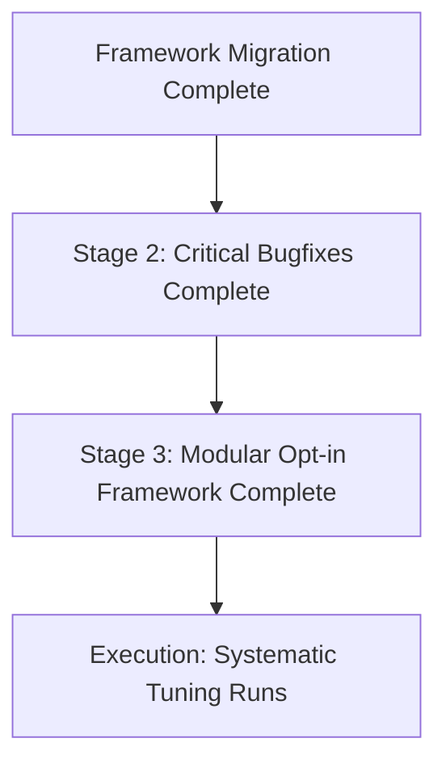

# In-Depth Engineering Analysis: Post-NiceGait3 Evolution & Framework Roadmap

**Baseline Commit:** `3dc5618` (*"NiceGait3" on branch `main`*)  
**Target Analysis Range:** All subsequent experimental commits and branches (`Slow`, `GaitClock1-7`, `NewReward`, `Memory`, and gravity-compensation features).

---

## Executive Summary

Since the verification of the **NiceGait3** (`3dc5618`) locomotion baseline, extensive development has occurred across two orthogonal axes:
1. **Framework & Deployment Infrastructure:** Substantial improvements to multi-phase training automation, dynamic inference adaptation, memory buffer management, simulation driver decimation, and CLI debugging telemetry.
2. **Policy, Environment & Reward Exploration:** Intensive algorithmic exploration aimed at resolving low-velocity locomotion (<0.3 m/s), mitigating Ground Reaction Force (GRF) spikes, eliminating base oscillations, and replacing heuristic gait shaping with a rhythmic, velocity-coupled Gait Phase Clock.

During these iterations, the coupling of architectural framework upgrades with experimental Markov Decision Process (MDP) modifications caused divergence from the smooth convergence and locomotion quality of NiceGait3. 

This document separates all developments into **Framework/Infrastructure Changes** (which should be preserved and migrated back to `main` cleanly) versus **Policy/Environment Changes** (which fundamentally alter RL training dynamics and require modular, gated re-introduction).

---

## Part 2: Policy, Environment & Reward Modifications
*Status: MDP ALGERING & DIVERGENCE SOURCE (Requires Selective / Behind-Flag Porting)*

These modifications directly altered the Isaac Lab training environment (`quadruped_env.py`), state geometry (`quadruped_env_cfg.py`), curriculum mechanics (`training_phases.yaml`), or reset dynamics. While developed to solve complex behavioral edge-cases, several of these changes collectively introduced reward stagnation during Phase 1 training and disrupted the early convergence characteristic of NiceGait3.

### 1. Observation Geometry & Environment Initialization
* **Configurable Recurrent Memory Buffer**: Shifted observation stacking management into YAML configuration (`obs_history_len` in `training_phases.yaml`). The full state output became a flattened tensor of size `num_envs x (obs_history_len * obs_dim_single)`.
* **Reset Buffer Cleanup vs. Historical Gradient Carryover**: Re-engineered `_reset_idx` to explicitly clear and re-replicate initial state tracking buffers across the entire history tensor upon environment termination. 
  * *Critical Divergence Note:* In the NiceGait3 baseline, historical buffers (such as `feet_air_time`, old observation history steps, and `previous_actions`) were not strictly cleared across environmental resets. This benign "buggy carryover" inadvertently provided an initial noise spectrum and high-magnitude reward gradient spike in early Phase 1 training that accelerated policy locomotion discovery. Clean zeroing of these buffers eliminated this early gradient incentive, contributing to early-stage reward stagnation.

### 2. Gait Clock Dynamics & Foot Symmetry
* **Gait Frequency Formula Evolution**: The coupling between commanded velocity and cyclical gait frequency ($f$) evolved through several mathematical forms across `ClockGait1-7`:
  * *Inverted/Linear iterations*: Initial approximations ($f = c \cdot v^2$ vs $f = \sqrt{v / c}$).
  * *Quadratic formulation*: $f = 0.2 \cdot v_{\text{eff}}^2$.
  * *Current Asymptote-Exponential formulation*:
    $$f(v_{\text{eff}}) = 0.6 \left(1 - e^{-5 v_{\text{eff}}}\right) + 0.4 v_{\text{eff}}$$
    where effective speed incorporates rotational turning velocity: $v_{\text{eff}} = \sqrt{v_x^2 + v_y^2} + 0.25 |\omega_z|$.
* **Velocity-Dependent Gait Blending**: Added logic in `quadruped_env.py` to calculate a sigmoid blending weight based on velocity, smoothly interpolating foot swing phase offsets from walking configurations at low speeds to trotting configurations (`[0.0, 0.5, 0.5, 0.0]`) at higher speeds.
* **Phase-Matched Swing Rewards & Penalties**:
  * Replaced unconditional air-time rewards with phase-matched Gaussian rewards (`rew_scale_gait_phase`), incentivizing leg lift timing exclusively inside scheduled swing windows.
  * Added L1 timing penalties (`rew_scale_gait_phase_l1`) for lifting feet outside designated windows, and grounded-swing penalties (`rew_scale_gait_missed_lift`) for failing to break contact during a swing phase.

---

## Part 3: Roadmap Status & Next Steps

The Framework & Infrastructure migration (Stage 1) is **COMPLETE**.
The Physical Correctness Bugfixes (Stage 2) are **COMPLETE**.
The Modularization of Advanced Locomotion Rewards (Stage 3) is **COMPLETE**. 

All features (including `base_acc_l2`, GRF penalties, and the low-speed odometry leash/stall penalties) have been surgically integrated into the codebase but defaulted to `0.0` in the baseline YAML configuration to prevent disruption of early-stage convergence.

### Next Steps: Systematic Tuning & Execution
1. **Baseline Validation:** Execute a full Phase 1 run using the pristine NiceGait3 baseline configuration (which is currently loaded and clean).
2. **Modular Activation:** Re-introduce stability regularizers (`rew_scale_base_acc_l2`, GRF thresholds) individually via systematic YAML parameter sweeps.
3. **Target:** Maintain the early-stage Phase 1 high-gradient policy convergence while incrementally trading reward headroom for low-velocity controllability and GRF smoothness.
